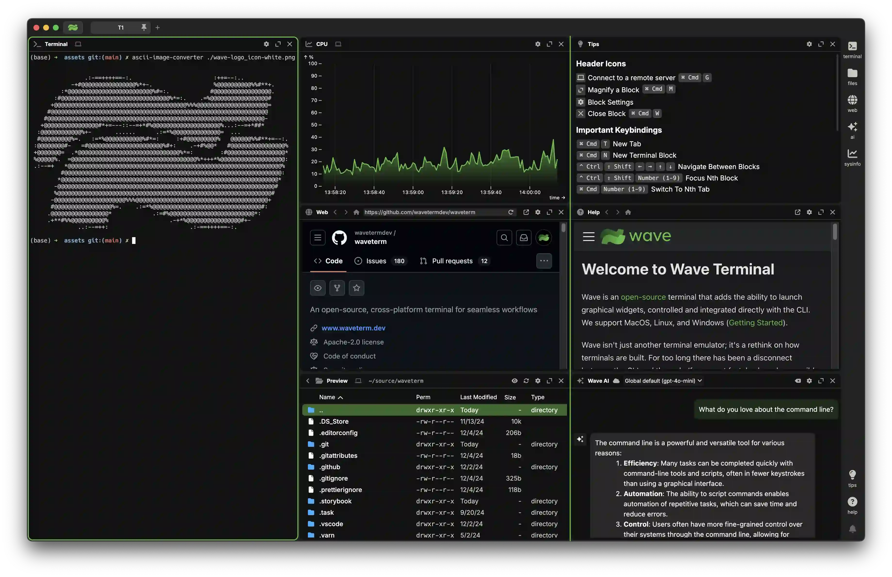
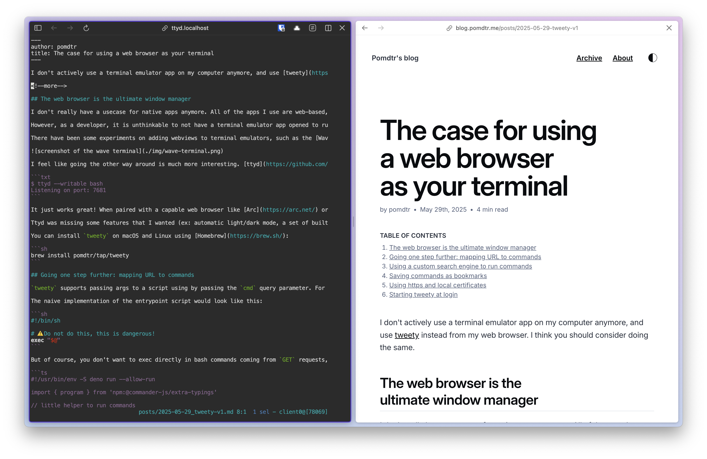
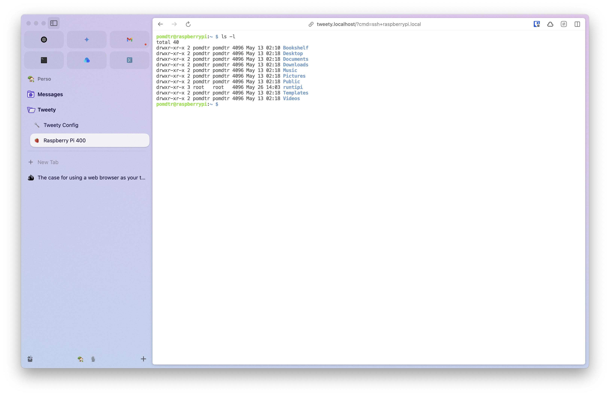

I don't actively use a terminal emulator app on my computer anymore, and use [tweety](https://github.com/pomdtr/tweety) instead from my web browser. I think you should consider doing the same.

<!--more-->

## My browser is eating my apps, and I like it

I don't really have a usecase for native apps anymore. All of the apps I use are web-based, so it make sense for me to use a web browser as my only opened app. Instead of having a bunch of window with their own set of tabs, I can manage everything from a single one.

However, as a developer, it is unthinkable to not have a terminal emulator app opened to run commands, manage and edit files, or interact with remote servers. Ideally, I would like those two remaining apps to be merged into a single one.

There have been some experiments on adding webviews to terminal emulators, such as the [Wave Terminal](https://www.waveterm.dev/) or [awrit](https://github.com/chase/awrit). However, while interesting, these projects are not a substitute to running a capable web browser.



I feel like going the other way around is much more interesting. [ttyd](https://github.com/tsl0922/ttyd) allows you to run a terminal emulator from a browser tab. It is mainly intended to share a terminal session over the web, but you can also run it completely locally.

```txt
$ ttyd --writable bash
Listening on port: 7681
```

It just works great! When paired with a capable web browser like [Arc](https://arc.net/) or [Zen](https://zen-browser.app/), you can easily even split websites and terminal sessions in the same view.



Ttyd was missing some features that I wanted (ex: automatic light/dark mode,or a set of builtin themes), so I created my own project inspired by it, called [tweety](https://github.com/pomdtr/tweety). The rest of this article will focus on this specific project, but you can apply the same ideas to ttyd.

You can install `tweety` on macOS and Linux using [Homebrew](https://brew.sh/):

```sh
brew install pomdtr/tap/tweety
```

## Going one step further: mapping URL to commands

`tweety` supports passing args to a script using by passing the `cmd` query parameter. For example, if you run `tweety ./entrypoint` the `http://localhost:9999/?cmd=nvim+~/.bashrc` url will be mapped to the command `./entrypoint nvim ~/.bashrc`.

The naive implementation of the entrypoint script would look like this:

```sh
#!/bin/sh

# ⚠️ Do not do this, this is dangerous!
exec "$@"
```

But of course, you don't want to directly exec shell commands coming from `GET` requests, as someone could just easily redirect you to a malicious url like `http://localhost:9999/?cmd=rm+-rf+%2F` and delete your entire filesystem.

So we'll the input use our entrypoint scripts to only allow a set of commands and arguments that we trust.

```ts
#!/usr/bin/env -S deno run --allow-run

import { program } from 'npm:@commander-js/extra-typings'

// little helper to run commands
async function run(command: string, ...args: string[]) {
    const cmd = new Deno.Command(command, { args });
    const process = cmd.spawn();
    await process.status;
}

// handle http://localhost:9999/
program.action(async () => {
    await run("bash")
})

// handle http://localhost:9999?cmd=htop
program.command("htop").action(async () => {
    await run("htop");
})

// handle http://localhost:9999?cmd=ssh+<host>
program.command("ssh").argument("<host>").action(async (host: string) => {
    await run("ssh", host);
})

// handle http://localhost:9999?cmd=config
program.command("config").action(async () => {
    const scriptPath = new URL(import.meta.url).pathname;
    await run("nvim", scriptPath)
})

// handle http://localhost:9999?cmd=nvim+<file>
program.command("nvim").argument("<file>").action(async (file) => {
    await run("nvim", file)
})

if (import.meta.main) {
    // parse arguments and run the appropriate command
    await program.parseAsync();
}
```

As a general rule, you should only allow commands that do not perform any destructive actions, such as `rm`, `mv`, or `cp` and instead use interactive commands like `nvim`, `htop` or `ssh` that requires user input to perform actions.

## Using a custom search engine to run commands

All modern web browsers supports defining custom search engines. You can use this feature to run commands directly from the address bar.

Just use `http://localhost:9999/?cmd=%s` as the URL, and `%s` as the placeholder for the command. You can then use `tweety` as a search engine to run commands directly from the address bar.

## Saving commands as bookmarks

Since each command has a unique URL, you can save them as bookmarks in your web browser. This allows you to quickly access frequently used commands without having to type them every time.

In the arc browser, I make use of the Favorites feature to group commands into folders. The ability to rename them and assign icons makes it easy to identify them at a glance.



## Using `https` and local certificates

By pairing a reverse proxy like [Caddy](https://caddyserver.com/), you can easily get a `https://` URL for your terminal emulator, protected behind local certificates.

```txt
tweety.localhost {
    tls internal
    reverse_proxy localhost:9999
}
```

Now you can acces your terminal emulator at `https://ttyd.localhost`.

## Starting `tweety` at login

Here is my plist file to start `tweety` at login on macOS. You can save it as `~/Library/LaunchAgents/com.github.pomdtr.tweety.plist` and load it with `launchctl load ~/Library/LaunchAgents/com.github.pomdtr.tweety.plist`.

```xml
<!DOCTYPE plist PUBLIC "-//Apple//DTD PLIST 1.0//EN" "http://www.apple.com/DTDs/PropertyList-1.0.dtd">
<plist version="1.0">
<dict>
    <key>KeepAlive</key>
    <true/>
    <key>Label</key>
    <string>com.github.pomdtr.tweety</string>
    <key>LimitLoadToSessionType</key>
    <array>
        <string>Aqua</string>
        <string>LoginWindow</string>
    </array>
    <key>ProgramArguments</key>
    <array>
        <string>/Users/pomdtr/go/bin/tweety</string>
        <string>--theme=Tomorrow</string>
        <string>--theme-dark=Tomorrow Night</string>
        <string>/Users/pomdtr/.config/tweety/entrypoint.ts</string>
    </array>
    <key>RunAtLoad</key>
    <true/>
    <key>StandardErrorPath</key>
    <string>/Users/pomdtr/Library/Logs/tweety.log</string>
    <key>StandardOutPath</key>
    <string>/Users/pomdtr/Library/Logs/tweety.log</string>
    <key>WorkingDirectory</key>
    <string>/Users/pomdtr</string>
    <key>EnvironmentVariables</key>
    <dict>
        <key>PATH</key>
        <string>/usr/local/bin:/usr/bin:/bin:/usr/sbin:/sbin:/opt/homebrew/bin:/Users/pomdtr/go/bin/</string>
    </dict>
</dict>
</plist>
```

On Linux, you should be able to use a systemd service instead.
