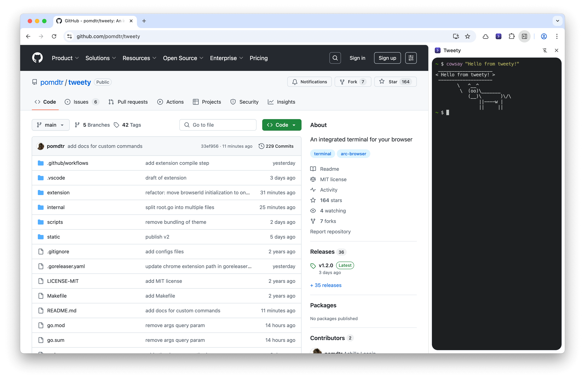
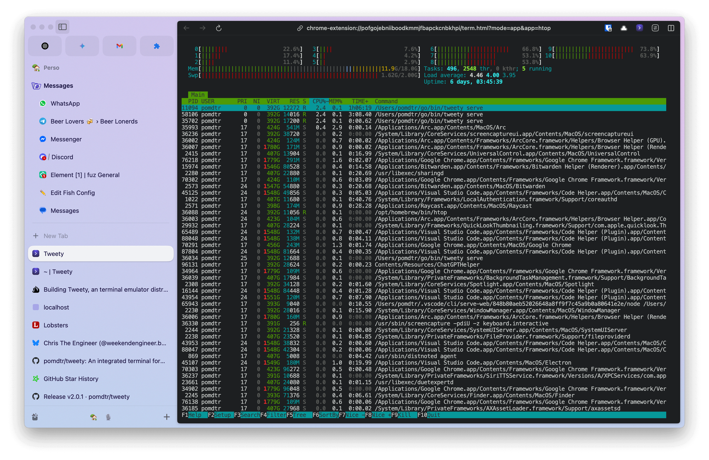
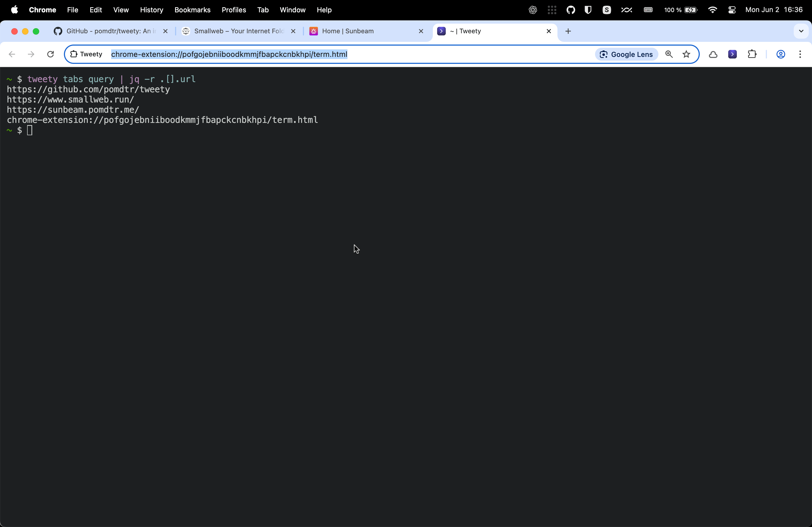
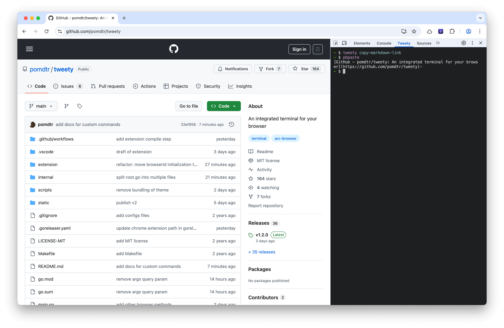

Last week, I [wrote](/posts/2025-05-29_tweety-v1) on using my browser as a terminal emulator. The post caught a lot of attention on [lobster.rs](https://lobste.rs/s/9j9wdi/case_for_using_web_browser_as_your), and I received some interesting feedback.

The most common criticism was that running a terminal from a browser tab was inherently insecure. There were also some concerns about the complexity of the setup, and the fact that it requires a server to run at all times.

I'm happy to report that I have a solution for both of these: [Tweety](https://github.com/pomdtr/tweety) is now distributed as a chrome extension!

<!-- more -->

## Why a Chrome extension?

Chrome extensions have a lot of interesting api to leverages. In addition to putting terminals in browser tabs, i'm now a able to create them as a sidebar, or even in the devtools panel!



Since chrome extensions page have an url, I can leverage query parameters to open specific views. Ex:

- `chrome-extension://<your-extension-id>/term.html?mode=ssh&host=vps`: opens a terminal in SSH mode, connected to the `vps` host.
- `chrome-extension://<your-extension-id>/term.html?mode=editor&file=/home/pomdtr/.bashrc`: open my `.bashrc` file in my default editor.

If I want to create an url for a specific app, I can just create a script in `~/.config/tweety/apps`, and I'll get a new url for it. For example, if I create a script `~/.config/tweety/apps/htop` with the following content:

```sh
#!/bin/sh

exec /usr/local/bin/htop
```

I'll get a new url for htop: `chrome-extension://<your-extension-id>/term.html?mode=app&app=htop`.



## The most underrated extension API: Native Messaging

The [Native Messaging API](https://developer.chrome.com/docs/extensions/develop/concepts/native-messaging) allows a Chrome extension to communicate with a native messaging host running on the user's computer. In our case, the native messaging host will be the `tweety` cli, that you can install using Homebrew:

```sh
brew install pomdtr/tap/tweety

# register the native messaging host
# currently you will need to install the extension manually, as it is not yet published on the Chrome Web Store
tweety install --extension-id <your-extension-id>
```

After you install the extension, your browser will look for the native messaging host registered by the extension each time it starts. If the host isn't already running, the browser will launch it (note: the native messaging host must be installed separately). The host communicates with the extension through standard input and output (stdin/stdout).

When you open new a Tweety tab, the extension will send a message to the native host, which will then start a terminal emulator session and return a websocket URL to the extension. The extension will then connect to the terminal emulator using this URL, and display the terminal in the tab.

## Proxying the chrome extension api through the `tweety` cli

In addition to the websocket server, the tweety server will start listening for JSON-RPC commands on an unix socket. This unix socket can be leveraged from the `tweety` CLI to access the extension API from your shell. In the screenshot below, `tweety tabs query` maps to the `chrome.tabs.query` API.



You can then compose those tweety commands with cli `tools` like `jq`, and build your own scripts in no time. For example, here is a script that generates a markdown link from the current tab:

```sh
#!/bin/sh

CURRENT_TAB=$(tweety tabs get)
URL=$(echo "$CURRENT_TAB" | jq -r .url)
TITLE=$(echo "$CURRENT_TAB" | jq -r .title)

printf "[%s](%s)" "$TITLE" "$URL" | pbcopy
```

If you store this script in `~/.config/commands/copy-markdown-link`, it will be added as a subcommand to the `tweety` CLI. Here is a screenshot of the command in action:


